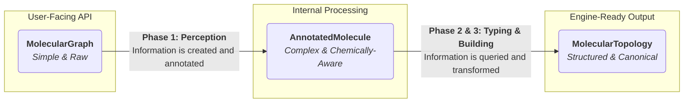

# Core Pipeline & Data Structures

The `dreid-typer` library operates on a robust pipeline model, where data is systematically transformed through a series of well-defined stages. The elegance and reliability of this pipeline are rooted in the design of three distinct data structures, each representing a different level of abstraction for a molecule. This document details these structures and their roles in the data flow.

The core philosophy is the **evolution of information**: from raw connectivity to a chemically-aware representation, and finally to a simulation-ready physical model.

## 1. The Key Data Structures

### 1.1 `MolecularGraph`: The Input Contract

The `MolecularGraph` is the sole entry point for user data into the system. It represents the lowest level of chemical abstraction: pure connectivity.

- **Purpose:** To define a molecule using only the most fundamental information: atoms (element and formal charge) and the bonds connecting them.
- **Structure:**
  - A list of `AtomNode`s.
  - A list of `BondEdge`s.
- **Design Rationale:**
  - **Simplicity:** The API is designed to be minimal and intuitive. Users are not required to pre-calculate any chemical properties like hybridization or ring membership. They simply define what they know: the atoms and their connections.
  - **Decoupling:** It decouples the user's representation of a molecule from the library's internal processing logic. This ensures a stable and predictable input contract.

```rust
// A conceptual representation of MolecularGraph's simplicity
pub struct MolecularGraph {
    pub atoms: Vec<AtomNode { element, .. }>,
    pub bonds: Vec<BondEdge { atom_ids, order, .. }>,
}
```

### 1.2 `AnnotatedMolecule`: The Internal Workspace

Once a `MolecularGraph` enters the pipeline, it is immediately converted into an `AnnotatedMolecule` (defined in `perception::model`). This is the most complex data structure in the library, serving as the central, chemically-aware workspace for the core algorithms.

- **Purpose:** To hold a rich, comprehensive set of perceived chemical properties for every atom. It is the single source of truth for the typing and building phases.
- **Structure:**
  - A list of `AnnotatedAtom`s, where each entry contains numerous fields:
    - Intrinsic properties (`element`, `formal_charge`).
    - Topological properties (`degree`, `is_in_ring`, `smallest_ring_size`).
    - Electronic properties (`lone_pairs`, `steric_number`, `hybridization`).
    - Aromaticity and resonance flags (`is_aromatic`, `is_anti_aromatic`, `is_resonant`).
  - An adjacency list for efficient neighbor traversal.
- **Design Rationale:**
  - **Centralized Knowledge:** By pre-calculating and storing all relevant properties in one place, the subsequent typing and building phases can be implemented as efficient, stateless queries against this data structure. This avoids redundant calculations.
  - **Factual Immutability:** The `AnnotatedMolecule` is constructed once during the **Perception Phase** and is treated as a read-only object thereafter. This immutability guarantees that the typing engine operates on a consistent and deterministic chemical context.

### 1.3 `MolecularTopology`: The Final Output

The `MolecularTopology` is the final product of the pipeline. It is a clean, structured representation tailored specifically for consumption by molecular simulation engines.

- **Purpose:** To provide a complete list of all particles and interaction terms (bonds, angles, torsions, inversions) required to define a DREIDING force field model.
- **Structure:**
  - A list of final `Atom`s, now including their assigned `atom_type`.
  - Deduplicated lists of `Bond`s, `Angle`s, `Torsion`s, and `Inversion`s.
- **Design Rationale:**
  - **Simulation-Oriented:** The structure directly maps to the needs of a simulation setup. It discards intermediate perception data (like `lone_pairs` or `steric_number`) that is not directly part of the final force field definition.
  - **Canonical Representation:** Each topological component (`Angle`, `Torsion`, `Inversion`) is stored in a canonical form (e.g., atom indices are sorted). This simplifies consumption by downstream tools, as it eliminates ambiguity and the need for further deduplication.

## 2. The Data Flow: A Deterministic Transformation

The entire process is a single, deterministic flow from the simplest input to the most structured output.



1. **Input to Workspace (`MolecularGraph` -> `AnnotatedMolecule`):**
   The `perception::perceive` function acts as the constructor for the `AnnotatedMolecule`. It takes the minimal `MolecularGraph` and performs all necessary chemical computations to build a fully annotated, "intelligent" graph. This is the most computationally intensive part of the process, where raw data is converted into chemical knowledge.

2. **Workspace to Output (`AnnotatedMolecule` -> `MolecularTopology`):**
   The `typing::engine::assign_types` and `builder::build_topology` functions work in concert to transform the rich `AnnotatedMolecule` into the final, lean `MolecularTopology`. This stage is not about discovering new information, but rather about **querying** the existing knowledge and **formatting** it according to the rules of the DREIDING model. The typing engine queries atomic properties to assign types, and the builder queries connectivity to generate geometric terms.

By strictly separating these data representations, `dreid-typer` achieves a clean architecture that is both robust and easy to reason about.
