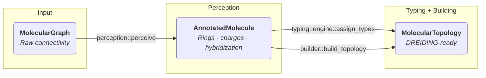

# Core Pipeline & Data Structures

The `dreid-typer` pipeline promotes data through three progressively richer representations. Each structure owns a distinct slice of information and exposes exactly what the next stage needs—no more, no less. This document recaps those structures and the deterministic transformations between them.

## 1. The Key Data Structures

### 1.1 `MolecularGraph`: The Input Contract

`MolecularGraph` is the only type users construct. It captures raw connectivity: a list of atoms (`AtomNode { element }`) and a list of bonds (`BondEdge { atom_ids, order }`). No aromatic flags, partial charges, or ring metadata are required.

- **Purpose:** Provide a minimal, validation-friendly representation of what is unquestionably known (elements + bonds).
- **Guarantees:** IDs are dense, bonds reference existing atoms, and bond orders come from the `BondOrder` enum (Single/Double/Triple/Aromatic).
- **Why it matters:** By freezing the input contract at this simple level the library can evolve internally without breaking callers.

```rust
pub struct MolecularGraph {
    pub atoms: Vec<AtomNode>,
    pub bonds: Vec<BondEdge>,
}
```

### 1.2 `AnnotatedMolecule`: The Chemical Workspace

`perception::perceive` upgrades a `MolecularGraph` into an `AnnotatedMolecule`. This structure mirrors the original atoms/bonds but augments each atom with the properties required by the typer and topology builder.

- **Contents:**
  - `atoms: Vec<AnnotatedAtom>` — each entry tracks element, formal charge, lone pairs, degree, ring flags, aromatic and anti-aromatic state, conjugation, resonance participation, steric number, and inferred hybridization.
  - `bonds: Vec<BondEdge>` — bond orders may change (e.g., aromatic edges are Kekulé-expanded).
  - `adjacency: Vec<Vec<(usize, BondOrder)>>` — cached neighbor lists for quick traversal without searching the bond table.
  - `rings: Vec<Vec<usize>>` — the Smallest Set of Smallest Rings (SSSR) discovered during perception.
- **Design intent:**
  - **Single source of truth:** all perception work (rings, Kekulé, electrons, aromaticity, resonance, hybridization) feeds this structure.
  - **Immutable after perception:** typing and building never mutate an `AnnotatedMolecule`; they only query it, which makes the whole pipeline deterministic.

### 1.3 `MolecularTopology`: The Simulation Output

`builder::build_topology` combines the `AnnotatedMolecule` with the final atom types from the typing engine and emits a `MolecularTopology`:

- `atoms: Vec<Atom>` — each atom records its element, inferred hybridization, and assigned DREIDING type string.
- `bonds`, `angles`, `proper_dihedrals`, `improper_dihedrals` — stored in canonical order and deduplicated through `HashSet`s.

It deliberately omits perception-era metadata (lone pairs, conjugation flags, etc.). Downstream MD engines only need atom types plus the geometric interaction lists.

## 2. Data Flow: Deterministic Enrichment



1. **Input → Workspace (`MolecularGraph` → `AnnotatedMolecule`):** the six-step perception pipeline discovers structural (rings, conjugation) and electronic (formal charges, lone pairs, resonance, hybridization) information. Aromatic bonds are Kekulé-expanded so every downstream consumer deals with explicit single/double orders.
2. **Workspace → Output (`AnnotatedMolecule` → `MolecularTopology`):** the typing engine uses the perceived properties to satisfy TOML rules, then the builder traverses the same adjacency lists to assemble canonical interaction terms.

Separating responsibilities this way keeps the chemistry heavy lifting in one place while letting typing and topology construction remain lightweight, predictable transformations.
