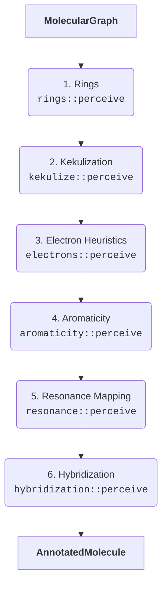

# Phase 1: Chemical Perception

Chemical perception starts with nothing more than `MolecularGraph` connectivity and ends with an `AnnotatedMolecule` packed with ring membership, Kekulé-expanded bonds, formal charges, conjugation flags, and hybridization. Every later phase (typing + topology building) simply reads the data created here, so correctness and determinism are critical.

## The Ordered Pipeline

`perception::perceive` executes six passes in a fixed order. Each pass depends on the artefacts emitted by the preceding one.

- **Rings** discover the Smallest Set of Smallest Rings (SSSR) so that later passes know which atoms are cyclic and what the smallest ring size is.
- **Kekulization** rewrites every aromatic bond into an explicit single/double assignment that satisfies valence limits.
- **Electron heuristics** assign formal charges, lone pairs, and special-case templates for nitro, sulfonyl, halogen oxyanions, etc.
- **Aromaticity** applies Hückel counting to each ring system and records whether atoms are aromatic or anti-aromatic.
- **Resonance** leverages the `pauling` crate plus local heuristics to mark conjugated atoms and damp unrealistic resonance participation (e.g., sulfate oxygens).
- **Hybridization** collapses degrees + lone pairs into a final hybridization label, with special handling for conjugated or aromatic atoms.

The rest of this document dives into each pass.

## Step 1 – Ring System Perception (`rings::perceive`)

The first task is topological: determine which atoms reside in rings. The algorithm computes the cyclomatic number to short-circuit acyclic graphs, then enumerates candidate cycles by temporarily removing each bond and finding a shortest path between its endpoints. From this candidate list the code selects a minimal cycle basis via Gaussian elimination over GF(2), producing an SSSR set.

For every atom in a detected ring the annotator sets `is_in_ring = true` and stores the smallest ring size observed. These flags are prerequisites for Kekulé expansion (aromatic bonds must live inside rings) and for aromaticity.

## Step 2 – Kekulé Expansion (`kekulize::perceive`)

Input molecules may use `BondOrder::Aromatic` to indicate resonance. Downstream components only understand concrete single/double orders, so this pass searches each connected aromatic system for a valid Kekulé assignment:

1. Group aromatic bonds into systems via BFS.
2. Run a backtracking solver that tries all single/double assignments while enforcing per-element valence limits (e.g., neutral nitrogen allows at most one double bond inside the system).
3. Apply the chosen orders to both the bond list and adjacency lists.

If any aromatic bond connects atoms that were not marked as ring members in Step 1, the pass emits `TyperError::PerceptionFailed` with details about the failing step.

## Step 3 – Electron & Charge Heuristics (`electrons::perceive`)

With concrete bond orders in place the perceiver can reason about electrons. Rather than a single generic formula, this crate implements a template-style pass that covers the tricky functional groups DREIDING cares about.

- **Nitro / nitrone / carboxylate:** assigns the correct +1/−1 charge split between the heteroatoms and sets heteroatom lone pairs (e.g., nitro oxygen holds three lone pairs when singly bound).
- **Sulfur & halogen oxyanions:** handles `SO2`, sulfones, sulfonates, and perchlorate-style centers by distributing charges onto terminal oxygens and leaving the central atom positively charged when appropriate.
- **Ammonium/iminium/onium/phosphonium:** detects degree-four nitrogen, oxygen, sulfur, and phosphorus centers and enforces +1 charges with the right lone-pair count.
- **Phenolate/enolate anions:** forces single-bound oxygens attached to `sp2` carbons to carry −1 charge and extra lone pairs.

Atoms touched here are marked as “processed” so they are not recomputed later in the same pass. All other atoms fall back to generic electron counting using valence, bond order, and formal charge.

## Step 4 – Aromaticity (`aromaticity::perceive`)

Armed with ring membership, explicit bond orders, and lone-pair counts, the aromaticity pass evaluates each ring system:

1. Build ring adjacency to cluster fused rings into systems.
2. For each system, ensure every atom is potentially planar (steric number ≤ 3, or special lone-pair cases).
3. Count π-electrons per atom:
   - Endocyclic double bond → +1
   - Lone pair donated into the ring (no exocyclic π bond) → +2
   - Formal charge −1 → +2; formal charge +1 → +0
   - Resonant flag from previous steps → +1 (captures delocalized contributions)
4. Classify as aromatic if the total satisfies $4n+2$, anti-aromatic if $4n$, neither otherwise.

If an entire fused system fails the aromatic test, each constituent ring is re-evaluated individually. At the end, every atom records whether it is aromatic, anti-aromatic, or neither.

## Step 5 – Resonance & Conjugation (`resonance::perceive`)

This phase bridges the gap between localized double bonds and the broader “is this atom part of a conjugated system?” question.

1. Call `pauling::find_resonance_systems` to obtain conjugated components and mark `is_in_conjugated_system` for all returned atoms.
2. Augment the raw result with chemistry-specific heuristics:
   - Aromatic atoms are always conjugated.
   - Amides, thioamides, and sulfonamides propagate conjugation from the carbonyl carbon into neighboring lone-pair donors.
   - Halogen oxyanions clamp their terminal oxygens to **not** conjugate (prevents incorrectly labeling perchlorate oxygens as resonant).
   - Purely σ-bound sulfurs are demoted out of conjugation even if upstream heuristics temporarily marked them.

This pass also sets `is_resonant` for atoms that originated from aromatic bonds before Kekulé expansion so that the typing engine can recognize `*_R` atom types without conflating resonance with aromaticity.

## Step 6 – Hybridization (`hybridization::perceive`)

The final pass converts the accumulated data into a definitive `Hybridization` enum per atom. The logic proceeds in priority order:

1. **Non-hybridized elements:** alkali/alkaline metals, halogens, noble gases, and most transition metals default to `Hybridization::None`.
2. **Conjugated overrides:** atoms flagged as conjugated (and not anti-aromatic) with steric number ≤ 3—or steric 4 with a lone pair—downgrade to `Hybridization::Resonant`, collapsing their steric number to 3 so the builder emits impropers.
3. **Aromatic planarity:** aromatic atoms default to `SP2` even if their steric number would imply 4, enforcing planarity in ring systems.
4. **VSEPR fallback:** remaining atoms map steric numbers to `SP3`/`SP2`/`SP`/`None`. Steric numbers above 4 trigger `PerceptionError::HybridizationInference`, surfacing impossible inputs early.

Each atom's final steric number is normalized after hybridization so that later components can rely on `steric_number` without recalculating.

## Output Guarantees

After the six passes finish, `AnnotatedMolecule` contains:

- Fully expanded bond orders (no `BondOrder::Aromatic`).
- Ring membership and smallest ring sizes.
- Formal charges, lone-pair counts, and degree for every atom.
- Aromatic / anti-aromatic / conjugated / resonant flags.
- Final steric number and `Hybridization` assignment.

This rich, immutable snapshot is the sole source of chemical truth for the Typing Engine and the Topology Builder.
