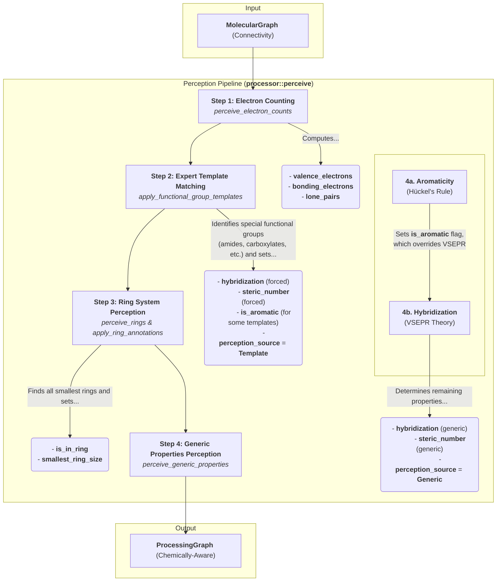

# Phase 1: Chemical Perception

The Chemical Perception phase is the first and most critical stage in the `dreid-typer` pipeline. Its purpose is to transform a simple, user-provided `MolecularGraph`—which only describes raw connectivity—into a chemically-aware `ProcessingGraph`. This is achieved by systematically inferring a rich set of properties for each atom, effectively teaching the library the "chemistry" of the molecule.

This phase employs a powerful hybrid paradigm, combining **general chemical algorithms** with a targeted **expert template system**. The entire process is orchestrated by the `processor::perceive` function.

## The Perception Pipeline

The perception process is a carefully ordered sequence of steps. Each step builds upon the information generated by the previous ones, culminating in a fully annotated `ProcessingGraph`. The order of these operations is crucial for ensuring correctness.

The diagram below details the flow of information within this phase, showing which properties are determined at each step.

### Step 1: Electron Counting

- **Function:** `processor::perception::perceive_electron_counts`
- **Purpose:** To establish the fundamental electronic configuration of each atom based on valence bond theory. This is the bedrock upon which all subsequent chemical judgments are made.
- **Algorithm:**
  1.  **Valence Electrons:** The number of valence electrons is determined based on the atom's element and its column in the periodic table.
  2.  **Bonding Electrons:** The number of electrons participating in bonds is calculated by summing the contributions from each bond connected to the atom (e.g., 1 for single, 2 for double). Aromatic bonds are treated as contributing 1 electron in this count, consistent with their delocalized nature.
  3.  **Lone Pairs:** The number of lone pairs is calculated using the formula:
      `lone_pairs = (valence_electrons - bonding_electrons - formal_charge) / 2`
      The result is floored to the nearest integer, assuming any remaining single electron is not a pair.

At the end of this step, each `AtomView` has its core electronic properties populated.

### Step 2: Expert Template Matching (The "Expert System")

- **Function:** `processor::templates::apply_functional_group_templates`
- **Purpose:** To correctly identify specific functional groups whose electronic structures are exceptions to simple, local chemical rules. For example, the nitrogen in an amide is planar (`sp2`) despite having a steric number that might suggest `sp3`.
- **Design Rationale (Why this is crucial):** A purely generic algorithm based on local connectivity (like VSEPR theory) cannot capture the non-local electronic effects of resonance that define many important functional groups. This "expert system" encodes this essential chemical knowledge.
- **Algorithm:**
  1.  The system iterates through a predefined list of functional group templates (e.g., carboxylate, guanidinium, nitro group).
  2.  For each template, it attempts to find a matching subgraph in the molecule. The matching is based on element types, bond orders, and formal charges.
  3.  When a match is found, the system applies predefined actions to the matched atoms, directly setting their `hybridization`, `steric_number`, and sometimes `is_aromatic` status.
  4.  Crucially, it also flags these atoms with `perception_source = Some(PerceptionSource::Template)`. This "locks" their properties, preventing them from being overridden by the generic algorithms in later steps.

### Step 3: Ring System Perception

- **Function:** `processor::perception::perceive_rings` and `apply_ring_annotations`
- **Purpose:** To identify all cyclic structures within the molecule, as ring membership is a key determinant for aromaticity and certain atom types.
- **Algorithm:**
  The library employs a path-based search algorithm to find the Smallest Set of Smallest Rings (SSSR). This algorithm is efficient and sufficient for the vast majority of molecules encountered in chemistry and biology.
- **Output:** The `is_in_ring` and `smallest_ring_size` fields of the relevant `AtomView`s are populated.

### Step 4: Generic Properties Perception

This final step handles all atoms that were not explicitly typed by the expert template system.

- **Function:** `processor::perception::perceive_generic_properties`

#### 4a. Aromaticity Perception

- **Purpose:** To identify aromatic systems based on Hückel's rule.
- **Algorithm:**
  1.  The system iterates through each ring found in Step 3.
  2.  For each ring, it calculates the total number of π-electrons. An atom's contribution is determined by its local environment:
      - An atom with a π-bond within the ring contributes **1** π-electron.
      - A heteroatom with a lone pair and no exocyclic π-bonds (like the nitrogen in pyrrole or oxygen in furan) contributes **2** π-electrons.
  3.  If the total number of π-electrons is `4n + 2` (where `n` is a non-negative integer) and all atoms in the ring are planar-compatible, the ring is considered aromatic.
  4.  The `is_aromatic` flag is set to `true` for all atoms in the identified aromatic ring.

#### 4b. Generic Hybridization Perception

- **Purpose:** To assign a hybridization state to all remaining atoms based on Valence Shell Electron Pair Repulsion (VSEPR) theory.
- **Algorithm:**
  1.  The system iterates through all atoms where `perception_source` is not `Template`.
  2.  **Aromatic Override:** If an atom's `is_aromatic` flag is `true`, its hybridization is immediately set to `Resonant`.
  3.  **VSEPR Calculation:** Otherwise, the `steric_number` is calculated as `degree + lone_pairs`.
  4.  **Mapping:** The hybridization is assigned based on the `steric_number`:
      - `steric_number = 4` -> `Hybridization::SP3`
      - `steric_number = 3` -> `Hybridization::SP2`
      - `steric_number = 2` -> `Hybridization::SP`
      - Certain elements like halogens or alkali metals are assigned `Hybridization::None`.
  5.  The `perception_source` for these atoms is set to `Some(PerceptionSource::Generic)`.

At the conclusion of this phase, every atom in the `ProcessingGraph` has a fully defined set of chemical properties, making it ready for the Typing Engine.
