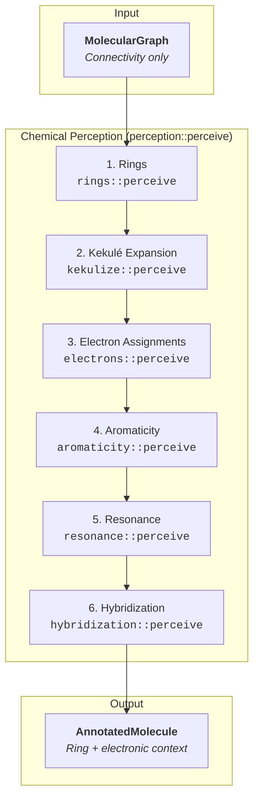

# Phase 1: Chemical Perception Overview

Chemical perception is the first stage in the `dreid-typer` pipeline. It transforms a minimal `MolecularGraph` (atoms + bonds) into an `AnnotatedMolecule`, a chemically-aware structure that records every property the typing and builder phases require. The orchestrator is `perception::perceive`, which executes six deterministic passes in a fixed order.

## Pipeline Overview

Each pass mutates the shared `AnnotatedMolecule`. Later stages can rely on the invariants produced by earlier ones (e.g., hybridization assumes resonance has already run). The following sections summarize the responsibilities of each pass.

## 1. Ring Detection — `rings::perceive`

- **Goal:** Identify the Smallest Set of Smallest Rings (SSSR) so that downstream logic knows which atoms are cyclic and how large the ring is.
- **How it works:** The pass enumerates candidates by temporarily removing bonds and searching for alternative paths, then selects a minimal cycle basis via bit-vector Gaussian elimination. Each ring is stored as a sorted list of atom IDs. Matching atoms are flagged with `is_in_ring = true` and `smallest_ring_size`.
- **Why it matters:** Aromaticity, resonance, and hybridization all depend on knowing whether atoms participate in cyclic systems.

## 2. Kekulé Expansion — `kekulize::perceive`

- **Goal:** Replace every aromatic bond with an explicit single/double assignment that respects valence and heteroatom allowances.
- **How it works:** The pass validates that every aromatic bond is fully contained within a ring, partitions the aromatic bonds into connected systems, and runs a backtracking Kekulé solver for each system. Nitrogen and phosphorus receive one "double-bond allowance" to enforce the correct valence counts. Successful assignments update both the bond table and the adjacency lists.
- **Why it matters:** Electron counting, aromaticity, and resonance all rely on concrete bond multiplicities. Without Kekulé expansion, delocalized input would prevent later passes from recognizing π-bonds.

## 3. Electron Assignments — `electrons::perceive`

- **Goal:** Populate `formal_charge` and `lone_pairs` for every atom via a mixture of targeted functional-group heuristics and a general valence fallback.
- **How it works:**
  - Pattern recognizers detect nitrones, nitro groups, sulfoxides/sulfones, halogen oxyanions, phosphoryl fragments, carboxylates, ammonium/iminium, onium/phosphonium ions, and enolate/phenate anions. When a pattern matches, the participating atoms are marked as processed and assigned the chemically expected charges/lone pairs.
  - Atoms that remain unprocessed fall back to a valence-based routine that balances valence electrons, bond orders, and existing formal charges.
- **Why it matters:** Accurate charges and lone-pair counts underpin aromaticity checks, resonance detection, and hybridization inference.

## 4. Aromaticity — `aromaticity::perceive`

- **Goal:** Classify fused ring systems as aromatic, anti-aromatic, or neither using a Hückel π-electron count with planarity heuristics.
- **How it works:** Rings are grouped into systems that share atoms. For each system, the model counts π-electrons contributed by in-ring double bonds, lone pairs, or formal charges, while also checking for cross-conjugation and planarity (via steric number heuristics). If the system is aromatic (4n+2 electrons) every atom in the system receives `is_aromatic = true`. Anti-aromatic systems (4n electrons) instead set `is_anti_aromatic = true`. Mixed systems fall back to per-ring evaluation.
- **Why it matters:** Aromatic flags influence resonance, hybridization, and ultimately the typing rules (e.g., `C_R`, `N_R`).

## 5. Resonance — `resonance::perceive`

- **Goal:** Mark atoms that participate in conjugated systems, even when they are not part of a strictly aromatic ring.
- **How it works:** The pass delegates to the external `pauling` crate to discover resonance systems, then overlays project-specific heuristics:
  - Aromatic atoms are always marked conjugated.
  - Amide/thioamide and sulfonamide motifs promote their heteroatom donors into conjugation when lone pairs are available.
  - Hypervalent halogen oxyanions have their terminal oxygens demoted to avoid false conjugation.
  - Purely σ-bound sulfurs that slipped through the previous steps are also demoted.
- **Why it matters:** Conjugation flags feed hybridization inference and help the typing engine distinguish resonant atoms from plain sp² centers.

## 6. Hybridization — `hybridization::perceive`

- **Goal:** Assign the final `Hybridization` enum and normalized `steric_number` for every atom.
- **How it works:** For each atom:
  - Elements that never hybridize (alkali metals, halogens, most transition metals) are stamped as `Hybridization::None`.
  - Conjugated atoms that are not anti-aromatic collapse to `Hybridization::Resonant`, even when their raw steric number is four (lone-pair donation collapses the geometry to trigonal).
  - Aromatic atoms default to `Hybridization::SP2`.
  - Remaining atoms fall back to VSEPR rules derived from `degree + lone_pairs`.
  - The stored `steric_number` is renormalized so downstream consumers can rely on 2/3/4 despite resonance collapsing a formal 4 to 3.
- **Why it matters:** The typing rules operate primarily on the `hybridization`, aromatic flags, and neighbor information produced by this pass. The builder also copies the final hybridization into the emitted topology.

---

By the end of chemical perception every `AnnotatedAtom` contains:

- identity (`element`, `id`, `degree`)
- ring context (`is_in_ring`, `smallest_ring_size`)
- electronic structure (`formal_charge`, `lone_pairs`, `is_resonant`, `is_in_conjugated_system`)
- aromaticity flags (`is_aromatic`, `is_anti_aromatic`)
- geometry (`hybridization`, normalized `steric_number`)

This richly annotated molecule is the single source of truth for both the typing engine and the topology builder.
