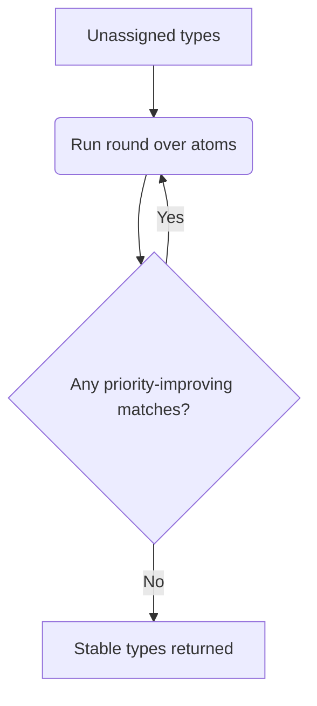

# Phase 2: The Typing Engine

Once perception has produced an `AnnotatedMolecule`, the typing engine converts that chemical knowledge into concrete DREIDING atom types. The heart of this stage is the `TyperEngine` in `typing::engine`, which evaluates a prioritized TOML rule set until every atom has a stable type.

## Inputs, Outputs, and Data Flow

- **Input graph:** the immutable `AnnotatedMolecule` emitted by `perception::perceive`. Each atom carries element, hybridization, charges, lone pairs, ring flags, resonance flags, and adjacency.
- **Rules:** a slice of `typing::rules::Rule` structs, typically `rules::get_default_rules()` but extendable with custom TOML files via `rules::parse_rules`.
- **Output:** a `Vec<String>` containing the final DREIDING type for each atom (index-aligned with the original `MolecularGraph`). These strings are later fused into the final `MolecularTopology`.

The engine never mutates the molecule. It only reads the perceived properties as predicates for rules.

## Rule Structure Recap

Every rule declares:

```toml
[[rule]]
name = "N_aromatic"
priority = 400
type = "N_R"
[rule.conditions]
element = "N"
is_aromatic = true
```

Key aspects used by the engine:

- **Priority (i32):** higher numbers dominate. After parsing, rules are sorted descending by priority, then by name for determinism.
- **Conditions:** a `Conditions` struct containing optional scalar filters (`element`, `degree`, `hybridization`, `is_aromatic`, etc.) plus two hash maps:
  - `neighbor_elements`: exact counts of neighboring elements.
  - `neighbor_types`: exact counts of _typed_ neighbors, enabling context-dependent logic (e.g., “needs two `C_R` atoms attached”).

Missing keys mean “don't care”, so even a fully generic fallback rule like `H_` is just `{ element = "H" }`.

## Fixed-point Iteration

The central challenge is that `neighbor_types` refers to the very output we are computing. To break the circular dependency, the engine performs deterministic rounds:

1. **Initialization:** every atom starts untyped. The `atom_states` array tracks `(type_name, priority)` for atoms that have been assigned.
2. **Round execution:** for each atom, find the first rule whose conditions match the current molecule and the current neighbor type assignments. If its priority is greater than the atom’s current priority (or the atom is untyped), update the atom’s state.
3. **Convergence test:** after scanning all atoms, if at least one atom changed in this round, start a new round. Otherwise, iteration stops and the collected types are returned.
4. **Safety limit:** the engine caps the number of rounds at 100. Hitting the cap indicates conflicting rules; the engine emits an `AssignmentError` describing the still-untyped atoms and the number of rounds attempted.

Because the rules are pre-sorted and upgrades only occur when priorities increase, iteration always converges to a unique fixed point for a given molecule and rule set.



## Matching Semantics

When evaluating a rule against an atom, the engine checks conditions in this order:

1. **Intrinsic properties:** element, formal charge, degree, lone pairs, hybridization, aromaticity flags, conjugation/resonance flags, ring membership, etc. All of these values come directly from `AnnotatedMolecule`.
2. **Neighbor elements:** constructs a histogram of the atom’s neighbors and compares it to `neighbor_elements`. Counts must match exactly; missing keys default to zero.
3. **Neighbor types:** uses the current `atom_states` table to count how many neighbors already have each requested type. If any neighbor referenced in the condition is still untyped, the rule simply fails this round and may succeed later once those neighbors acquire types.

Any failed check short-circuits the rest; only atoms meeting _all_ specified conditions qualify for the rule.

## Worked Example: Ethanol (`CH3-CH2-OH`)

1. **Round 1:**
   - Carbons satisfy the `C_3` rule (`steric_number = 4`) with priority 100.
   - The oxygen matches `O_3` (same priority), picking up `Hybridization::SP3` and `type = "O_3"`.
   - The hydroxyl hydrogen matches `H_HB` (priority ~250) because its neighbor elements histogram includes one oxygen.
   - Remaining hydrogens fall back to the generic `H_` rule (priority 1).
2. **Round 2:** re-evaluating atoms discovers no higher-priority matches, so the engine exits with the types assigned in the previous round.

## Error Paths and Diagnostics

- **Unresolved atoms:** if, after 100 rounds, one or more atoms never found a matching rule with sufficient priority, the engine returns `AssignmentError { untyped_atom_ids, rounds_completed }`. This usually indicates a missing custom rule.
- **Precondition failures:** any error emitted by perception (invalid graph, Kekulé failure, etc.) occurs before the typing engine runs.

The error types bubble up through `assign_topology`/`assign_topology_with_rules`, so callers can surface precise diagnostics to users.

## Extending the Engine

To introduce custom types:

1. Parse or build new `Rule` entries (e.g., `rules::parse_rules(include_str!("my.rules.toml"))`).
2. Append them to a `Vec` that also contains the defaults.
3. Pass the combined slice into `assign_topology_with_rules`.

Because the engine relies purely on the provided rule list, no additional hooks are required—new chemistry is just another rule.

## Key Takeaways

- The typing engine is deterministic: same molecule + same rules = same output.
- Priorities resolve conflicts; iteration resolves dependencies introduced by `neighbor_types`.
- Diagnostics surface untyped atoms if the rule set is incomplete.
- Everything runs off the immutable `AnnotatedMolecule`, keeping perception and typing cleanly separated.
