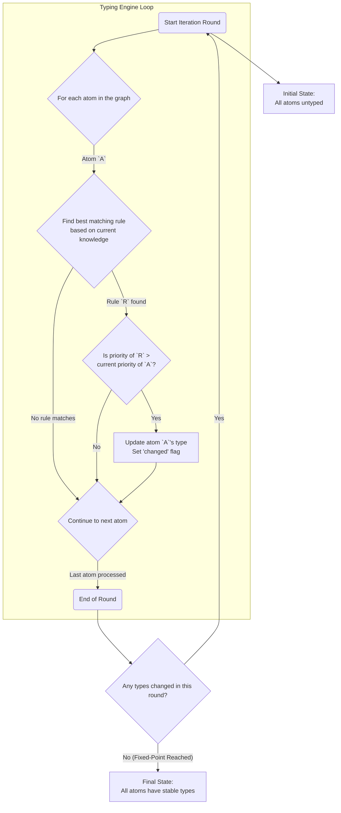

# Phase 2: The Typing Engine

The Typing Engine is the decision-making core of the `dreid-typer` library. Its sole responsibility is to assign a definitive DREIDING atom type to every atom in the molecule. It operates on the chemically-aware `ProcessingGraph` produced by the Perception phase and uses a sophisticated algorithm to resolve types, even in complex, context-dependent scenarios.

This document details the challenges of atom typing and the design of the iterative, priority-based engine that solves them.

## The Challenge of Context-Dependent Typing

Atom typing is not always a simple, local decision. The correct type for an atom can often depend on the types of its neighbors. A classic example is the hydrogen atom:

- A hydrogen bonded to a carbon is typically a standard type (`H_`).
- A hydrogen bonded to an oxygen or nitrogen is a special type capable of hydrogen bonding (`H_HB`).

This creates a "chicken-and-egg" problem: to type the hydrogen, we need to know the type of its neighbor, but the neighbor's type might also be in the process of being determined. A simple, one-pass approach to rule matching is insufficient to solve this.

## The Solution: An Iterative, Priority-Based Engine

To address this challenge, `dreid-typer` implements a **deterministic fixed-point iteration algorithm** within the `TyperEngine`. This engine ensures that type information propagates throughout the molecule until a stable, self-consistent state is reached.

The engine's logic is governed by two fundamental principles: **priority** and **iteration**.

### 1. Priority: Resolving Rule Conflicts

Each rule in the `.toml` file has a `priority` value. When an atom's properties match the conditions of multiple rules, the rule with the **highest priority number** always wins.

- **Purpose:** This mechanism ensures that specific, detailed rules override more general, generic ones.
- **Example:** A rule for an aromatic carbon (`C_R`, priority 400) will always be chosen over a rule for a generic sp2 carbon (`C_2`, priority 200), even though an aromatic carbon is technically also sp2 hybridized.

The engine begins by sorting all provided rules in descending order of priority. During matching, it simply uses the first rule it finds in this sorted list.

### 2. Iteration: Propagating Context

The engine runs in rounds. In each round, it attempts to assign or update the type for every atom in the molecule.

- **Purpose:** Iteration allows type information to propagate from atom to atom. This is how the engine solves the context-dependency problem.
- **Termination:** The engine continues to run new rounds as long as at least one atom's type was changed in the previous round. When a full round completes with zero changes, the system has reached a **fixed-point**, or a stable state. At this point, the types are considered final.
- **Determinism:** Because types are only ever updated by higher-priority rules, this process is guaranteed to terminate and will always produce the exact same result for a given molecule and ruleset.

### A Walkthrough: Typing Ethanol (`CH3-CH2-OH`)

Let's trace how the engine types the hydrogen atoms in ethanol.

1. **Initial State:** All atoms are untyped. The `ProcessingGraph` knows that one hydrogen (`H_o`) is bonded to an oxygen, and the others are bonded to carbons.

2. **Round 1:**

   - **Carbon & Oxygen Atoms:** The `C_3` (sp3 Carbon) and `O_3` (sp3 Oxygen) rules have high priority (100). They match based on `steric_number = 4` and are immediately assigned.
   - **Hydrogen Atoms:** The engine now evaluates the hydrogens.
     - For `H_o` (on oxygen): It matches the `H_Donor_On_Oxygen` rule (priority 250), which has a condition `{ neighbor_elements = { O = 1 } }`. It is assigned the type `H_HB`.
     - For the other hydrogens (on carbon): They do not match any high-priority hydrogen rules. They _do_ match the `H_Standard_Default` rule (priority 1). They are assigned the type `H_`.
   - **Result of Round 1:** All atoms have been assigned a type. Many changes occurred.

3. **Round 2:**

   - The engine re-evaluates every atom.
   - It finds that for every atom, the best matching rule is the same one that was applied in Round 1. No rule with a higher priority can be found for any atom.
   - **Result of Round 2:** Zero changes are made.

4. **Termination:** Since Round 2 produced no changes, the engine terminates. The final, correct types (`C_3`, `O_3`, `H_HB`, `H_`) are returned.

This iterative process, guided by priority, allows `dreid-typer` to robustly solve complex chemical typing problems in a predictable and deterministic way.
