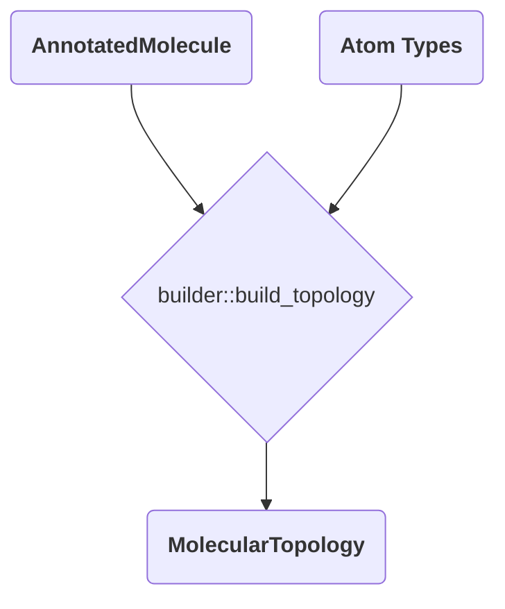

# Phase 3: The Topology Builder

With atom types resolved, the builder translates the annotated molecule into a `MolecularTopology`. This stage is pure graph traversal — no additional chemistry is inferred — but it’s where canonical force-field terms emerge.

`builder::build_topology` takes two inputs:

1. The immutable `AnnotatedMolecule` output of perception.
2. The `Vec<String>` of atom types returned by the typing engine.

It produces `MolecularTopology { atoms, bonds, angles, propers, impropers }`, all deduplicated and ready for downstream MD engines.



## Atom Table

`build_atoms` walks the annotated atoms and copies their element, hybridization, and ID while splicing in the final type string (`atom_types[ann_atom.id]`). This produces the topology’s `atoms` vector.

## Connectivity Terms

Every interaction term uses the molecule’s adjacency lists and bond table, which already reflect Kekulé-expanded bond orders.

### Bonds

`build_bonds` maps each `BondEdge` to a `Bond`, sorting the atom indices so that `(i, j)` and `(j, i)` collapse to the same representation. The resulting set is stored in a `HashSet<Bond>` to prevent duplicates before being collected into a `Vec`.

### Angles (`build_angles`)

For each atom `j` (the angle center), consider all unordered pairs of neighbors `(i, k)` taken from `adjacency[j]`. Each pair yields `Angle::new(i, j, k)`, which internally sorts the outer atoms to maintain canonical order. Because combinations are generated without repetition, every unique `i-j-k` angle appears exactly once.

Pseudocode:

```text
for center in atoms:
    neighbors = adjacency[center]
    for each unordered pair (i, k) in neighbors:
        angles.insert(Angle::new(i, center, k))
```

### Proper Dihedrals (`build_propers`)

Proper torsions are enumerated around each bond `j-k`:

1. Iterate over every stored bond.
2. For each neighbor `i` of `j` (excluding `k`) and each neighbor `l` of `k` (excluding `j` and `i`), emit `ProperDihedral::new(i, j, k, l)`.
3. The constructor compares `(i, j, k, l)` to its reverse `(l, k, j, i)` and keeps the lexicographically smaller tuple to guarantee uniqueness.

This approach naturally covers both directions (i.e., `i-j-k-l` and `l-k-j-i`) without generating duplicates.

### Improper Dihedrals (`build_impropers`)

Improper torsions enforce planarity at trigonal centers. The builder scans every atom and checks two conditions:

1. Degree equals 3.
2. Hybridization equals `Hybridization::SP2` or `Hybridization::Resonant`.

If satisfied, the atom’s three neighbors form the outer atoms while the center occupies the third index of `ImproperDihedral::new(p1, p2, center, p3)`. The constructor sorts the three peripheral atoms but keeps the central atom fixed, delivering a canonical key.

## Why Canonical Forms Matter

- **Deduplication:** All intermediate collections are `HashSet`s, so deterministic ordering of atom IDs is required to detect duplicates.
- **Stable output:** Simulation pipelines downstream can diff or cache topologies knowing that rerunning the builder yields identical ordering.
- **Serialization friendliness:** Canonical tuples simplify hashing/serialization and reduce noise in reference files.

## Error Handling

The builder assumes its inputs are valid. By the time `build_topology` runs, perception has already verified graph connectivity, and typing has succeeded. Therefore, the functions are infallible and cannot produce errors on their own.

## Summary

The topology builder does not invent new chemistry; it formalizes the perceived molecule into the geometric primitives expected by DREIDING-compatible engines. Canonical ordering and set-based generation ensure reproducible, duplicate-free interaction lists every time.
