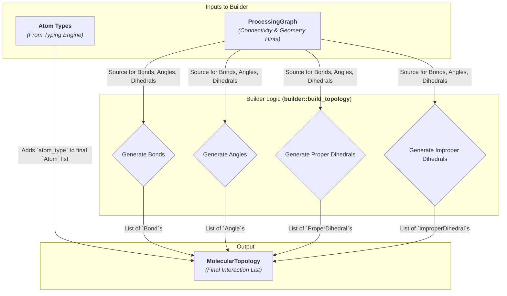

# Phase 3: The Topology Builder

The Topology Builder is the final stage of the `dreid-typer` pipeline, orchestrated by the `builder::build_topology` function. Its purpose is to translate the chemically-aware `ProcessingGraph` and the assigned atom types into a `MolecularTopology`, which is a complete, simulation-ready description of the molecule's force field terms.

This phase marks the transition from a **chemical representation** (what the molecule _is_) to a **physical model** (how its parts _interact_). It systematically generates all required geometric interaction terms: angles, proper dihedrals, and improper dihedrals.

## The Generation Algorithms

The builder employs a set of systematic graph traversal algorithms to ensure that every valid interaction term is generated exactly once.



### 1. Generating Bonds

- **Source:** The original `MolecularGraph`.
- **Algorithm:** This is the most straightforward step. The builder iterates through the list of `BondEdge`s from the input graph and converts them into the final `Bond` format. During this process, the atom indices within each bond are sorted to create a **canonical representation**.

### 2. Generating Angles (`build_angles`)

- **Purpose:** To identify all unique triplets of bonded atoms `i-j-k`.
- **Algorithm:** The builder iterates through every atom `j` in the molecule and considers it as a potential angle center.

  1. For each atom `j`, it retrieves its list of bonded neighbors.
  2. It then generates all unique combinations of two neighbors, `i` and `k`, from this list.
  3. Each combination forms a new `Angle` `(i, j, k)`.

  This combinatorial approach guarantees that every possible angle is found.

  ```
  For each atom j:
    neighbors = get_neighbors(j)
    For each pair (i, k) in combinations(neighbors, 2):
      add_angle(i, j, k)
  ```

### 3. Generating Proper Dihedrals (`build_proper_dihedrals`)

- **Purpose:** To identify all unique quartets of bonded atoms `i-j-k-l` that define a torsion angle.
- **Algorithm:** The algorithm is centered around the central bond `j-k` of the dihedral.

  1. The builder iterates through every bond `j-k` in the molecule.
  2. For each bond, it considers atom `j`: it iterates through all of `j`'s neighbors, excluding `k`, to find all possible atoms `i`.
  3. Simultaneously, it considers atom `k`: it iterates through all of `k`'s neighbors, excluding `j`, to find all possible atoms `l`.
  4. Every valid combination of `i`, `j`, `k`, and `l` forms a new `ProperDihedral` `(i, j, k, l)`.

  ```
  For each bond (j, k):
    For each neighbor i of j (where i != k):
      For each neighbor l of k (where l != j):
        add_proper_dihedral(i, j, k, l)
  ```

### 4. Generating Improper Dihedrals (`build_improper_dihedrals`)

- **Purpose:** To identify specific quartets of atoms that define an out-of-plane bending angle. In DREIDING, this term is primarily used to enforce planarity at `sp2`-hybridized centers.
- **Algorithm:** Unlike other terms, improper dihedrals are not found by traversing bond paths. Instead, they are identified based on the properties of a central atom.
  1. The builder iterates through every atom `i` in the molecule.
  2. It checks if atom `i` meets the DREIDING criteria for an improper center:
     - It must have exactly three bonded neighbors (`degree = 3`).
     - Its perceived hybridization must be `SP2` or `Resonant`.
  3. If both conditions are met, an `ImproperDihedral` is created. Atom `i` is the central atom, and its three neighbors (`j`, `k`, `l`) define the plane.

### The Principle of Canonical Representation

A critical design feature of the builder is its commitment to **canonical representation**. Before a new `Angle`, `ProperDihedral`, or `ImproperDihedral` is created, its constituent atom indices are sorted according to a deterministic rule.

- **`Angle(i, j, k)`:** The outer atoms `i` and `k` are sorted. `Angle(1, 2, 3)` becomes identical to `Angle(3, 2, 1)`.
- **`ProperDihedral(i, j, k, l)`:** The entire tuple is compared to its reverse `(l, k, j, i)`, and the lexicographically smaller of the two is stored.
- **`ImproperDihedral(i, j, k, l)`:** The three plane atoms are sorted, with the central atom always in the third position.

**Design Rationale (Why this is important):**

1. **Deduplication:** This allows for the efficient use of a `HashSet` during generation to automatically discard duplicate terms, ensuring the final list is unique.
2. **Predictable Output:** It provides a stable and predictable output format. Downstream simulation engines or analysis tools do not need to perform their own normalization; they can rely on the fact that any given geometric term will always have the same representation.
3. **Simplicity for Consumers:** It simplifies the logic for any tool that consumes this topology, as it removes ambiguity in how interactions are defined.
