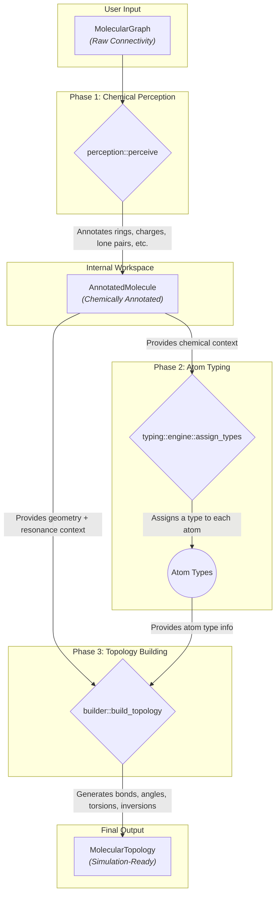

# DreidTyper: Architecture

This document provides an in-depth guide to the internal design and implementation of the `dreid-typer` library. It is intended for developers who wish to contribute to the project, integrate it into larger systems, or understand the technical details of modern chemical informatics software.

The architecture is guided by principles of **modularity**, **extensibility**, **correctness**, and **performance**. It translates raw chemical connectivity into a simulation-ready topology through a deterministic, three-stage pipeline where each stage has a single responsibility and exposes a narrow API.

## High-Level Architecture: The Three-Phase Pipeline

The core of `dreid-typer` is a **Three-Phase Data Processing Pipeline**: **Perceive-Type-Build**. This design elegantly decomposes the complex task of topology perception into distinct, manageable stages. Each stage consumes data from the previous one, enriches it, and passes it to the next, ensuring a clear and robust flow of information.

The diagram below illustrates this flow, highlighting the key data structures and the transformation they undergo at each stage.

- **Phase 1: Perception (`perception::perceive`):** Takes the raw `MolecularGraph` and emits an `AnnotatedMolecule`. Six ordered passes (rings, kekulization, electrons, aromaticity, resonance, hybridization) enrich each atom with bonding, charge, lone-pair, ring, and delocalization metadata. The output is immutable and shared with later stages.

- **Phase 2: Typing (`typing::engine::assign_types`):** Runs a deterministic fixed-point solver over the `AnnotatedMolecule`. It evaluates TOML rules parsed via `typing::rules::parse_rules`, honoring priorities and neighbor-dependent constraints until every atom is assigned a DREIDING type.

- **Phase 3: Building (`builder::build_topology`):** Consumes the annotated atoms plus the final type vector to produce a canonical `MolecularTopology`. Helper routines enumerate bonds, angles, torsions, and inversions, and collapse duplicates using canonical ordering so downstream engines receive stable identifiers.

## Directory of Architectural Documents

For a deeper dive into each component and the design rationale behind it, please refer to the following documents:

- **[Core Pipeline & Data Structures](./01_pipeline.md):** Describes the `MolecularGraph → AnnotatedMolecule → MolecularTopology` flow and the invariants enforced between stages.
- **[Phase 1: Chemical Perception](./02_perception.md):** Details the six perception passes, including how resonance state and hybridization are inferred from ring analyses and charge bookkeeping.
- **[Phase 2: The Typing Engine](./03_typing_engine.md):** Explains the fixed-point solver, rule priorities, and how neighbor-dependent conditions converge deterministically.
- **[Phase 3: The Topology Builder](./04_topology_builder.md):** Outlines the canonical term generation strategy and helper utilities used to collapse symmetry.
- **[Reference: The DREIDING Rule System](./05_rule_system.md):** A complete reference for the TOML rule syntax, condition keys, and the packaged ruleset.
