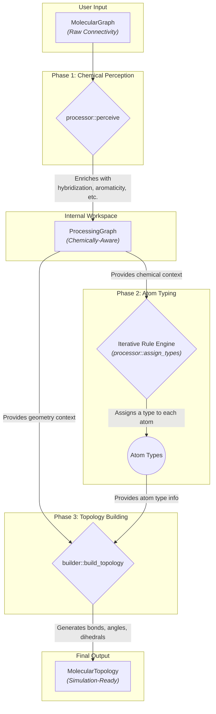

# DreidTyper: Architecture

This document provides an in-depth guide to the internal design and implementation of the `dreid-typer` library. It is intended for developers who wish to contribute to the project, integrate it into larger systems, or understand the technical details of modern chemical informatics software.

The architecture is guided by principles of **modularity**, **extensibility**, **correctness**, and **performance**. It translates raw chemical connectivity into a simulation-ready topology through a deterministic, multi-stage process.

## High-Level Architecture: The Three-Phase Pipeline

The core of `dreid-typer` is a **Three-Phase Data Processing Pipeline**: **Perceive-Type-Build**. This design elegantly decomposes the complex task of topology perception into distinct, manageable stages. Each stage consumes data from the previous one, enriches it, and passes it to the next, ensuring a clear and robust flow of information.

The diagram below illustrates this flow, highlighting the key data structures and the transformation they undergo at each stage.

- **Phase 1: Perception:** This initial stage transforms the raw, user-provided connectivity (`MolecularGraph`) into a chemically intelligent `ProcessingGraph`. It's where the library "understands" the chemistry of the molecule by annotating atoms with properties like hybridization, ring membership, and aromaticity.

- **Phase 2: Typing:** A sophisticated, iterative rule engine runs on the `ProcessingGraph`. It assigns a definitive DREIDING atom type to each atom by matching its perceived properties against a prioritized set of rules.

- **Phase 3: Building:** The final stage consumes the `ProcessingGraph` and the assigned atom types to construct the `MolecularTopology`. This involves generating the complete list of bonds, angles, and dihedrals required by a simulation engine.

## Directory of Architectural Documents

For a deeper dive into each component and the design rationale behind it, please refer to the following documents:

- **[Core Pipeline & Data Structures](./01_pipeline.md):** Describes the data flow and the crucial role of the `MolecularGraph`, `ProcessingGraph`, and `MolecularTopology` structures.
- **[Phase 1: Chemical Perception](./02_perception.md):** Details the algorithms for ring detection, aromaticity, and the powerful hybrid approach of using a generic engine alongside an expert template system.
- **[Phase 2: The Typing Engine](./03_typing_engine.md):** Explains the iterative, priority-based algorithm that ensures deterministic and correct type assignment, even in context-dependent scenarios.
- **[Phase 3: The Topology Builder](./04_topology_builder.md):** Outlines the procedures for generating angles and dihedrals, including the concept of canonical representation.
- **[Reference: The DREIDING Rule System](./05_rule_system.md):** A complete reference for the TOML rule syntax and the default ruleset.
